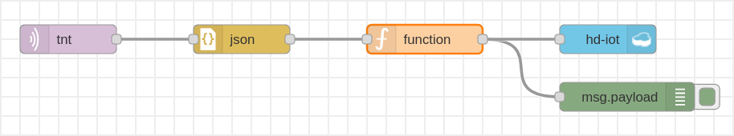

# Desafio

## Proposta

A proposta do desafio da TNT encontra-se no submódulo "desafio".

## Solução

Para a solução do desafio na plataforma da *IBM Cloud*, foi utilizado o
*Node-RED* (ver [node-red-flows.json](solução/node-red-flows.json)) para coletar
documentos em formato JSON de um dispositivo IOT da TNT via protocolo MQTT e
armazená-los em um banco de dados *NoSQL* (o *Cloudant*):

Depois, os dados foram explorados em um *Jupyter notebook* (ver
[notebook.ipynb](solução/notebook.ipynb)), hospedado no *Watson Studio*, com o
qual também foram treinados diversos modelos de *machine learning* para uma
comparação de seu desempenho (entre eles, *Support-vector machine* e
*Gradient Boosting*). O melhor modelo foi então utilizado para fazer previsões
de quando é necessário o reabastecimento de cada ponto de vendas.
