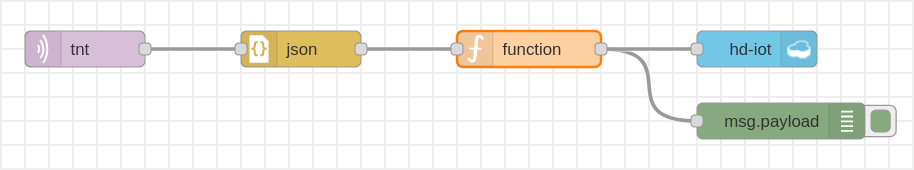

# Maratona Behind The Code 2020

Este repositório reúne os códigos e recursos que utilizei para resolver os
oito desafios de negócios propostos na [Maratona Behind The Code](https://maratona.dev/pt) da IBM de 2020.
As soluções propostas garantiram o 239º lugar no ranking geral da maratona no
Brasil, entre as dezenas de milhares de participantes.

A descrição e os arquivos fornecidos como base para cada desafio encontram-se
no subdiretório "desafio" correspondente (que é um submódulo do git, clonado a
partir dos repositórios da maratona).

## Desafios

### Cocamar

O [desafio proposto pela Cocamar](https://github.com/maratonadev-br/desafio-1-2020)
encontra-se no submódulo "1-cocamar/desafio".

Para a solução do desafio na plataforma da *IBM Cloud*, foi utilizado o *Watson
Studio* para treinar um modelo de *Visual Recognition* com base em:

* 57 imagens da classe `lagarta`
* 59 imagens da classe `percevejo_marrom`
* 53 imagens da classe `percevejo_pequeno`
* 96 imagens da classe `percevejo_verde`
* 78 imagens da classe `Negative`

O modelo de inteligencia artificial resultante foi utilizado para classificar
imagens em uma aplicação web implementada com o Cloud Foundry.

**Observação**: As imagens não foram incluídas neste repositório pois, embora
possam ser obtidas na internet, nem todas estão sob domínio público ou sob uma
licença livre. Para encontrar tais imagens, pode ser usado tanto o Google
Images, quanto os sites que constam no arquivo
[websites.yml](1-cocamar/solução/websites.yml).

### Uninassau

O [desafio proposto pela Uninassau](https://github.com/maratonadev-br/desafio-2-2020)
encontra-se no submódulo "2-uninassau/desafio".

Para a solução do desafio de ciência de dados na plataforma da *IBM Cloud*,
foram utilizados *Jupyter notebooks*, hospedados no *Watson Studio*, para
explorar os dados sobre os estudantes e seu desempenho nas disciplinas de seus
cursos (vide notebook [parte-1.ipynb](2-uninassau/solução/parte-1.ipynb)). Com base nessa
exploração, foram definidos os *features* adequados para o treinamento de um
modelo classificador baseado em árvores de decisão, capaz de identificar o
perfil dos estudantes (vide notebook [parte-2.ipynb](2-uninassau/solução/parte-2.ipynb)). O
modelo obtido foi integrado com uma solução de assistente virtual voltada para
a tutoria remota através do *Watson Machine Learning*.

### FIAP

O [desafio proposto pela FIAP](https://github.com/maratonadev-br/desafio-3-2020)
encontra-se no submódulo "3-fiap/desafio".

Para a solução do desafio na plataforma da *IBM Cloud*, foi utilizado um
Jupyter notebook em Python ([extração.ipynb](3-fiap/solução/extração.ipynb)) para
extrair os dados dos websites propostos e convertê-los para o formato JSON.
Esta [coleção de arquivos JSON](3-fiap/solução/dados) foi carregada no
*Watson Discovery*, juntamente com algumas [perguntas](3-fiap/solução/perguntas)
relevantes ao conteúdo de cada documento, para treinar um modelo capaz de
recomendar artigos ou vídeos baseados no interesse do usuário.

**Observação**: Infelizmente não foi feito backup da coleção nem das anotações
no *Watson Discovery*, então o diretório da solução contém apenas o código em
Python usado na etapa de extração dos dados, e um rascunho das perguntas.

### Algar Tech

O [desafio proposto pela Algar Tech](https://github.com/maratonadev-br/desafio-4-2020)
encontra-se no submódulo "4-algar-tech/desafio".

Para a solução do desafio na plataforma da *IBM Cloud*, os dados do arquivo
`algar-dataset-treino.csv` (fornecido como parte do
[cloud-pak-project-modeler-flow-4.zip](https://github.com/maratonadev-br/desafio-4-2020/blob/master/cloud-pak-project-modeler-flow-4.zip))
foram analisados e tratados em um fluxo construído no *SPSS Modeler*:

A última etapa deste fluxo foi um modelo de
de máquina de vetores de suporte linear (*LSVM*), treinado para prever quais
candidatos devem e quais não devem ser contratados. O modelo implementado com
esta solução de ciência de dados foi então hospedado no
*Watson Machine Learning*.

### Tecban

O [desafio proposto pela Tecban](https://github.com/maratonadev-br/desafio-5-2020)
encontra-se no submódulo "5-tecban/desafio".

Para a solução do desafio na plataforma da *IBM Cloud*, foi construído o
diálogo (ver arquivo
[skill-TecBan-Oficial.json](5-tecban/solução/skill-TecBan-Oficial.json)) de um
*chatbot*, utilizando o *Watson Assistent* para o
*processamento de linguagem natural* (*NLP*). O resultado foi um
*assistente virtual inteligente*, integrado à API da Tecban, capaz de interagir
com o usuário identificando suas intenções (saudação, saque ou finalização).

### LIT

O [desafio proposto pela Saint Paul](https://github.com/maratonadev-br/desafio-6-2020)
encontra-se no submódulo "6-saint-paul-lit/desafio".

Para a solução do desafio de ciência de dados na plataforma da *IBM Cloud*,
foi utilizado um *Jupyter notebook*, hospedado no *Watson Studio*, para
explorar os dados de estudantes (vide
[notebook.ipynb](6-saint-paul-lit/solução/notebook.ipynb)). Com base nessa exploração, foram
definidos os *features* adequados para o treinamento de um modelo de
aprendizado de máquina baseado em floresta aleatória (*RandomForestClassifier*)
capaz de classificar os alunos de acordo com seu perfil. O modelo foi usado
para gerar as previsões na planilha [results.csv](6-saint-paul-lit/solução/results.csv).

### TNT

O [desafio proposto pela TNT](https://github.com/maratonadev-br/desafio-7-2020)
encontra-se no submódulo "7-tnt/desafio".

Para a solução do desafio na plataforma da *IBM Cloud*, foi utilizado o
*Node-RED* (ver [node-red-flows.json](7-tnt/solução/node-red-flows.json)) para coletar
documentos em formato JSON de um dispositivo IOT da TNT via protocolo MQTT e
armazená-los em um banco de dados *NoSQL* (o *Cloudant*):

Depois, os dados foram explorados em um *Jupyter notebook* (ver
[notebook.ipynb](7-tnt/solução/notebook.ipynb)), hospedado no *Watson Studio*, com o
qual também foram treinados diversos modelos de *machine learning* para uma
comparação de seu desempenho (entre eles, *Support-vector machine* e
*Gradient Boosting*). O melhor modelo foi então utilizado para fazer previsões
de quando é necessário o reabastecimento de cada ponto de vendas.

### Fiat Chrysler Automobiles

O [desafio proposto pela FCA](https://github.com/maratonadev-br/desafio-8-2020)
encontra-se no submódulo "8-fiat-chrysler-automobiles/desafio".

Para a solução do desafio na plataforma da *IBM Cloud*, foi criado um modelo
no Watson Knowledge Studio para anotação de texto em linguagem natural. Depois,
foi utilizado o *Node-RED* (ver [node-red-flows.json](8-fiat-chrysler-automobiles/solução/node-red-flows.json))
para construir uma API de análise de sentimentos e recomendação, integrada com os
serviços *Watson Natural Language Understanding* e *Watson Speech-to-Text*
(*STT*), como ilustrado a seguir:

