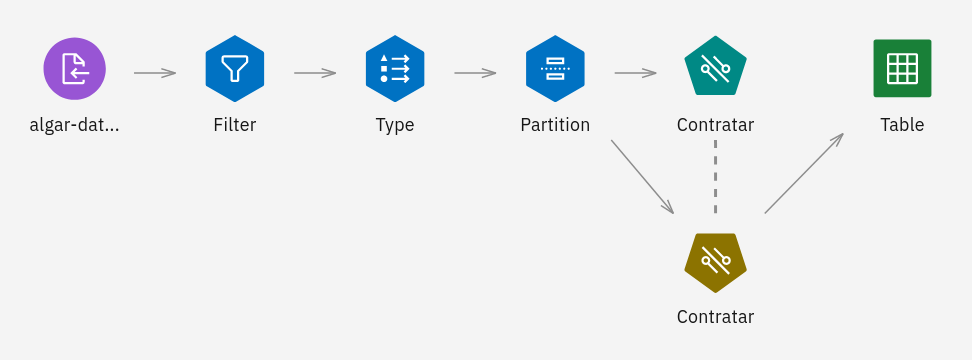

# Desafio

## Proposta

A proposta do desafio da Algar Tech encontra-se no submódulo "desafio".

## Solução

Para a solução do desafio na plataforma da *IBM Cloud*, os dados do arquivo
`algar-dataset-treino.csv` (fornecido como parte do
[cloud-pak-project-modeler-flow-4.zip](desafio/cloud-pak-project-modeler-flow-4.zip))
foram analisados e tratados em um fluxo construído no *SPSS Modeler*:

A última etapa deste fluxo foi um modelo de
de máquina de vetores de suporte linear (*LSVM*), treinado para prever quais
candidatos devem e quais não devem ser contratados. O modelo implementado com
esta solução de ciência de dados foi então hospedado no
*Watson Machine Learning*.
